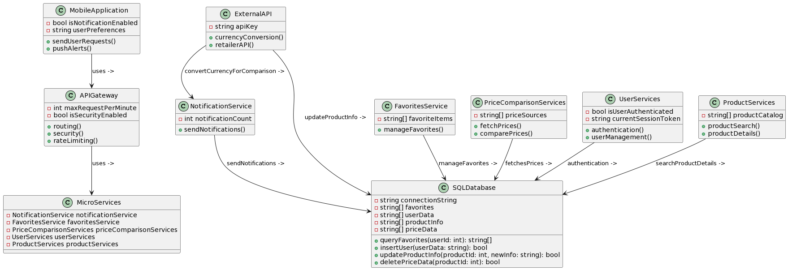

# PROJECT Design Documentation

## Project Name: Price Compare Plus

## Team Information

- Team name: TEAM 1
- Team members
  - Kush Jayesh Ahir
  - Love Jayesh Ahir
  - Shridhar Vilas Shinde
  - Bharathi Pandurangan

## Executive Summary

The "Price Compare Plus" project is to provide a mobile application that gives consumers access to product details and price comparisons from different online merchants. It provides customers with a comprehensive tool to locate the cheapest prices on a variety of items by centralizing data from several sources. The program aims to improve the online shopping experience by providing access to comprehensive product descriptions, reviews, and price notifications, which will facilitate informed decision-making.

## Requirements

This section describes the features of the application.

### Definition of MVP

The "Price Compare Plus" MVP is a mobile application that enables users to browse product details, compare prices from various online merchants, search for items, save favorites, and get alerts when prices drop.

### MVP Features

1. User Authentication: Implement user registration and login functionality to allow users to create accounts and log in securely.
2. Product Search: Enable users to search for products by name using a search bar or a search function.
3. Product Details Display: Display detailed information about each product, including its features, specifications, and descriptions.
4. Price Comparison: Gather pricing information for the searched product from different online retailers and display them in a comparative format.
5. Save Favorites: Allow users to save products they're interested in, to a favorites list for easy access later.
6. Product Reviews: Integrate product review functionality to provide users with insights from other consumers' experiences.
7. Sort and Filter Options: Provide users with the ability to sort search results by criteria such as price, relevance, or ratings, and filter results based on factors like brand, price range, or availability.
8. Product Image Display: Show images of the searched product to help users identify it visually.
9. Basic User Interface (UI): Create a simple intuitive user interface with essential components such as search bar, product display area, and navigation menu.
10. Responsive Design: Ensure that the app is responsive and works well on various mobile devices and screen sizes.
11. Currency Conversion: Incorporate currency conversion functionality to allow users to view prices in their preferred currency. This feature can be especially useful for users who shop across different regions or countries.
12. Price Drop Notifications: Enable users to receive notifications when the prices of their saved favorite products drop below a specified threshold. This feature allows users to take advantage of discounts and promotions without constantly monitoring prices themselves.

## Architecture and Design

This section describes the application architecture.

### Software Architecture

The "Price Compare Plus" application employs a microservices architecture to enable robust, scalable online shopping features. The architecture is delineated into several key components:

- **Mobile App**: The front-end interface that interacts with users, pushing alerts and sending user requests.
- **Microservices**: Decomposed backend services, including:
  - **Notification Service**: Manages and sends notifications to users.
  - **Favorites Service**: Handles the management of user favorites.
  - **Price Comparison Service**: Fetches and compares prices from various sources.
  - **User Service**: Responsible for authentication and user management.
  - **Product Service**: Manages product search and details retrieval.
- **External APIs**: Interfaces with Currency Conversion API and Retailer APIs to update product information and facilitate currency conversion.
- **API Gateway**: Acts as the entry point for all client requests, routing them to the appropriate microservice and providing security measures like rate limiting.
- **SQL Database**: Stores user data including credentials and profiles as well as product-related data such as price data and favorites for quick retrieval.

The architecture supports both RESTful services and third-party API integration, ensuring that product information is current and accurate. The use of both SQL and NoSQL databases caters to the efficient management of structured and unstructured data respectively.

### Use Cases

**Actors**: The diagram includes three actors: User, Admin, and System.
**Use Cases**: Within the "Price Compare Plus" package, there are several key use cases outlined:

- User-related use cases such as User Authentication, Product Search, Save Favorites, and Sort and Filter Options.
- System-related use cases including Price Comparison, Product Details Display, Product Image Display, Currency Conversion, and Price Drop Notifications.
- The Manage User use case is specifically related to the Admin actor, indicating their ability to manage user-related functionalities.

### Class Diagram

1. MobileApplication:

Attributes:

1. isNotificationEnabled: A boolean indicating whether notifications are enabled for the user.
2. userPreferences: A string that stores user preferences, likely in a serialized format.

Operations: 1. sendUserRequests(): A method for sending user requests, perhaps to an API or server. 2. pushAlerts(): A method to push alerts to the user, likely notifications.

2. APIGateway:

Attributes:

1. maxRequestPerMinute: An integer indicating the maximum number of requests per minute the gateway can handle, used for rate limiting.
2. isSecurityEnabled: A boolean that indicates whether security measures like authentication and authorization are active.

Operations:

1. routing(): Determines the route for incoming requests to the appropriate services.
2. security(): Handles security checks for incoming requests.
3. rateLimiting(): Enforces rate limiting on incoming requests to prevent abuse.

4. ExternalAPI:

Attributes:

1. apiKey: A string used for API authentication, unique to each consumer of the API.

Operations:

1. currencyConversion(): Converts currency values, possibly using external financial data.
2. retailerAPI(): Interacts with retailer APIs, likely fetching or updating product information.

3. NotificationService:

Attributes:

1. notificationCount: An integer to keep track of notifications sent or pending.

Operations:

1. sendNotifications(): Sends notifications to users, perhaps through email or push notifications.

2. FavoritesService:

Attributes:

1. favoriteItems: An array of strings, probably storing identifiers for user's favorite items.

Operations:

1. manageFavorites(): Provides functionality to add, remove, or update favorite items for a user.

2. PriceComparisonServices:

Attributes:

1. priceSources: An array of strings, likely URLs or identifiers of different price sources.

Operations:

1. fetchPrices(): Retrieves prices from various sources for comparison.
2. comparePrices(): Compares prices of the same product from different sources.

3. UserServices:

Attributes:

1. isUserAuthenticated: A boolean indicating whether a user is currently authenticated.
2. currentSessionToken: A string holding the session token for the authenticated user.

Operations:

1. authentication(): Handles user authentication processes.
2. userManagement(): Manages user data, such as creating, updating, or deleting user accounts.

3. ProductServices:

Attributes:

1. productCatalog: An array of strings, possibly containing product identifiers or names.

Operations:

1. productSearch(): Searches for products in the catalog.
2. productDetails(): Retrieves detailed information for a specific product.

9.SQLDatabase:

Attributes:

1. connectionString: A string used to establish a connection to the SQL database.
2. favorites, userData, productInfo, priceData: Arrays of strings to hold corresponding data, structured for database storage.

Operations:

1. queryFavorites(userId: int): Returns a user's favorite items from the database.
2. insertUser(userData: string): Inserts new user data into the database.
3. updateProductInfo(productId: int, newInfo: string): Updates product information in the database.
4. deletePriceData(productId: int): Deletes price data for a product from the database.
