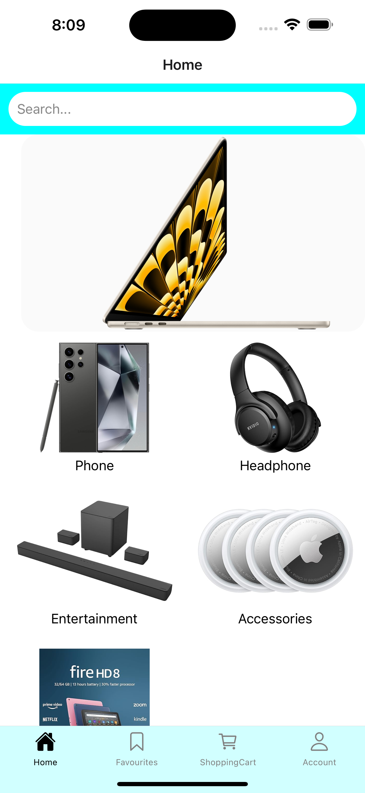
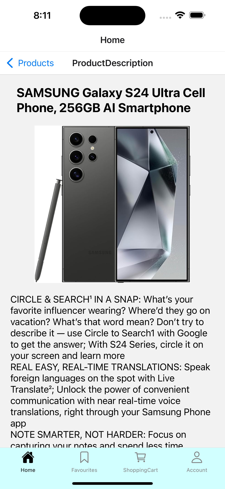
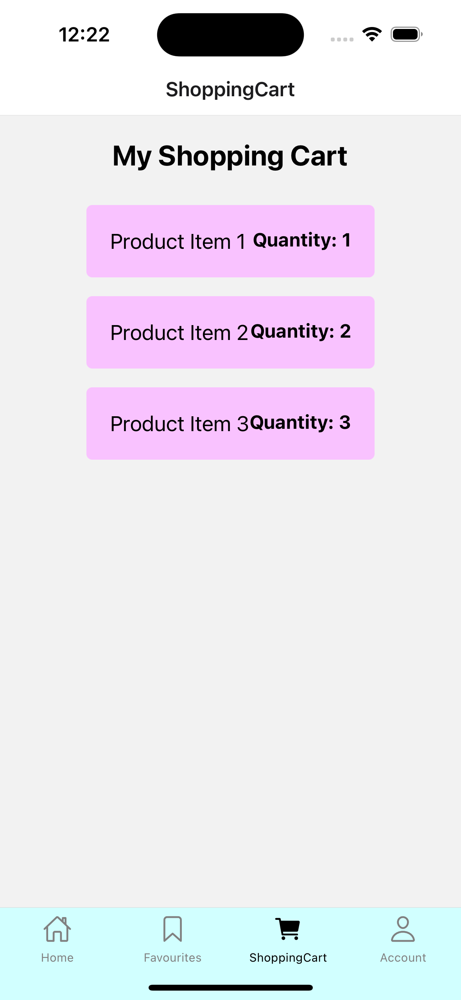

# Design Documentation for Price Compare Plus

## Overview

Price Compare Plus is a comprehensive price comparison application that allows users to search for products, compare prices, save favorites, and receive notifications on price drops. This document outlines the user interface design and the user experience flow.

## Features and Screens

### 1. User Authentication

#### Sign Up Page

- **Path**: `/signup`
- **Description**: Allows new users to register by providing their personal details.
- **Fields**:
  - First Name
  - Last Name
  - Email
  - Username
  - Password
  - Confirm Password

#### Login Page

- **Path**: `/login`
- **Description**: Facilitates user login to access personalized features.
- **Fields**:
  - Username
  - Password

### 2. Product Search

- **Path**: `/search`
- **Description**: A search bar on the home page that allows users to find products by name.
- **Features**:
  - Auto-complete suggestions
  - Search history

### 3. Product Details Display

- **Path**: `/product/:id`
- **Description**: Displays detailed information about products, including specs, reviews, and pricing options from different retailers.

### 4. Price Comparison

- **Path**: `/product/:id/prices`
- **Description**: Shows a comparative price listing from various online retailers.

### 5. Save Favorites

- **Path**: `/favorites`
- **Description**: Allows users to save and manage their favorite products.

### 6. Notifications

- **Description**: Alerts users about price drops or special deals on their favorite products.

### 7. Responsive Design

- **Description**: Ensures that the application is accessible and user-friendly on various devices, including tablets and smartphones.

### 8. Sort and Filter Options

- **Description**: Provides users with the ability to sort search results by criteria such as price, relevance, or ratings, and filter results based on factors like brand, price range, or availability.

### 9. Product Image Display

- **Description**: Shows images of the searched product to help users identify it visually.

### 10. Basic User Interface (UI)

- **Description**: A simple intuitive user interface with essential components such as search bar, product display area, and navigation menu.

### 11. Currency Conversion

- **Description**: Incorporates currency conversion functionality to allow users to view prices in their preferred currency. This feature can be especially useful for users who shop across different regions or countries.

### 12. Shopping Cart

- **Path**: `/cart`
- **Description**: The shopping cart feature allows users to manage the products they intend to purchase. It provides a central place to add items from the product details page, view them, update quantities, remove items, or proceed to checkout.
- **Features**:
  - **Add to Cart**: Users can add products to their cart directly from the product details pages.
  - **View Cart**: The cart page shows all items the user has added, including product details such as name, price, quantity, and a subtotal for each item.
  - **Update Quantity**: Users can change the quantity of each product directly in the cart if they decide they want more or fewer units.
  - **Remove from Cart**: Each item in the cart includes a remove button to allow users to easily remove items they no longer wish to purchase.

## Architecture and Design

### Software Architecture

The "Price Compare Plus" application employs a microservices architecture to enable robust, scalable online shopping features. The architecture is delineated into several key components:

- **Mobile App**: The front-end interface that interacts with users, pushing alerts and sending user requests.
- **Microservices**: Decomposed backend services, including:
  - **Notification Service**: Manages and sends notifications to users.
  - **Favorites Service**: Handles the management of user favorites.
  - **Price Comparison Service**: Fetches and compares prices from various sources.
  - **User Service**: Responsible for authentication and user management.
  - **Product Service**: Manages product search and details retrieval.
- **External APIs**: Interfaces with Currency Conversion API and Retailer APIs to update product information and facilitate currency conversion.
- **API Gateway**: Acts as the entry point for all client requests, routing them to the appropriate microservice and providing security measures like rate limiting.
- **SQL Database**: Stores user data including credentials and profiles as well as product-related data such as price data and favorites for quick retrieval.

### Use Cases

**Actors**: The diagram includes three actors: User, Admin, and System.
**Use Cases**: Within the "Price Compare Plus" package, there are several key use cases outlined:

- User-related use cases such as User Authentication, Product Search, Save Favorites, Sort and Filter Options, and Shopping Cart Management.
- System-related use cases including Price Comparison, Product Details Display, Product Image Display, Currency Conversion, and Price Drop Notifications.

### Class Diagram

### Class Diagram Description

- **User Class**:
  - **Attributes**:
    - UserID: int - A unique identifier for each user.
    - Username: String - The username of the user.
    - Password: String - The password of the user.
    - Email: String - The email address of the user.
  - **Operations**:
    - login(): void - Allows the user to log in to the application.
    - register(): void - Allows the user to register for an account.
    - logout(): void - Allows the user to log out of the application.

- **Product Class**:
  - **Attributes**:
    - ProductID: int - A unique identifier for each product.
    - Description: String - A description of the product.
    - Price: double - The price of the product.
    - Brand: string - The brand of the product.
  - **Operations**:
    - getDetails(): void - Retrieves the details of a product.
    - imageURL(): void - Retrieves the image URL of a product.

- **Notification Class**:
  - **Attributes**:
    - NotificationID: int - A unique identifier for each notification.
    - UserID: int - The ID of the user who received the notification.
    - Message: String - The content of the notification.
    - Timestamp: DateTime - The date and time the notification was sent.

- **Authentication Class**:
  - **Attributes**:
    - Username: String - The username of the user.
    - Password: String - The password of the user.
  - **Operations**:
    - login(): void - Allows the user to log in to the application.
    - logout(): void - Allows the user to log out of the application.

- **Shopping Cart Class**:
  - **Attributes**:
    - CartID: int - A unique identifier for each shopping cart.
    - UserID: int - The ID of the user who owns the shopping cart.
    - ProductList: List<Product> - A list of products in the shopping cart.
    - TotalAmount: double - The total amount of the items in the shopping cart.
  - **Operations**:
    - addProduct(Product): void - Adds a product to the shopping cart.
    - removeProduct(Product): void - Removes a product from the shopping cart.
    - checkout(): void - Completes the checkout process.

- **Favorites Class**:
  - **Attributes**:
    - FavoriteID: int - A unique identifier for each favorite item.
    - UserID: int - The ID of the user who favorited the item.
    - ProductID: int - The ID of the product that is favorited.

- **Price Comparison Class**:
  - **Attributes**:
    - ProductID: int - The ID of the product.
    - RetailerID: int - The ID of the retailer who is selling it.

- **Currency Conversion Class**:
  - **Operations**:
    - convert(amount: double, fromCurrency: String, toCurrency: String): double - Converts a specified amount from one currency to another.

### Database Schema

Detail the database schema used for users, products, favorites, etc.

## Accessibility Features

Outline any accessibility features included, such as screen reader support, high contrast themes, etc.

## Security Measures

Describe the security measures in place to protect user data and prevent unauthorized access.

## Conclusion

Summarize the design goals and expectations for the user experience of the application.
