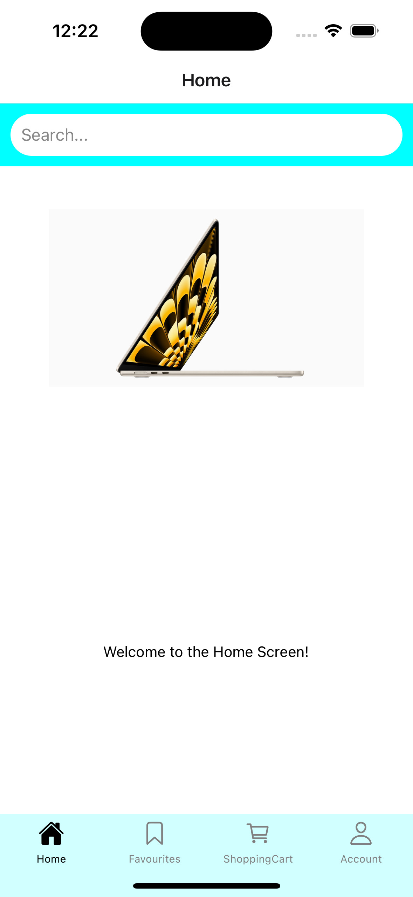

# Price Compare Plus - User Authentication Feature

## Overview

Price Compare Plus's User Authentication feature ensures a secure and personalized shopping experience for users. The system allows users to sign up, log in, and access their accounts, which enables them to use functionalities like searching for products, adding them to favorites, and maintaining a shopping cart.

## Features

### Sign Up

The sign-up page is the entry point for new users. The process is straightforward, requesting essential information:

- First Name
- Last Name
- Email
- Username
- Password (hashed for security)
- Confirm Password

Form validations are in place to ensure data integrity. A session key is generated at this stage but remains null until the user logs in.
Passwords are hashed before storage.

### Log In

Returning users will authenticate themselves on the login page by entering their:

- Username
- Password

Upon successful authentication, a unique session key is generated to manage the user's session. The system includes protective measures such as validation checks that trigger generic error messages for improved user privacy. 
- Incorrect Username
    - If a user enters a username that does not exist in the database, they will receive the following message:
    - **"Invalid username or password, please try again."**
- Incorrect Password
    - If a user enters a valid username but the wrong password, they will receive the same message as above:
    - **"Invalid password, please try again."**

### Home

The home page serves as the main dashboard, featuring:

- A search bar for product queries.
- Navigation buttons for the Home, Favorites, Shopping Cart, and Account sections.

### Shopping Cart

The shopping cart displays all the products that the user intends to purchase. Each product includes details like quantity and pricing.

### Account

The Account section displays the logged-in user's:

- Username
- First Name
- Last Name
- Email

A logout option is available for users to end their session. On logout, the session key is reset to null to maintain security, preventing unauthorized access and maintaining the privacy and integrity of the user's session.

---