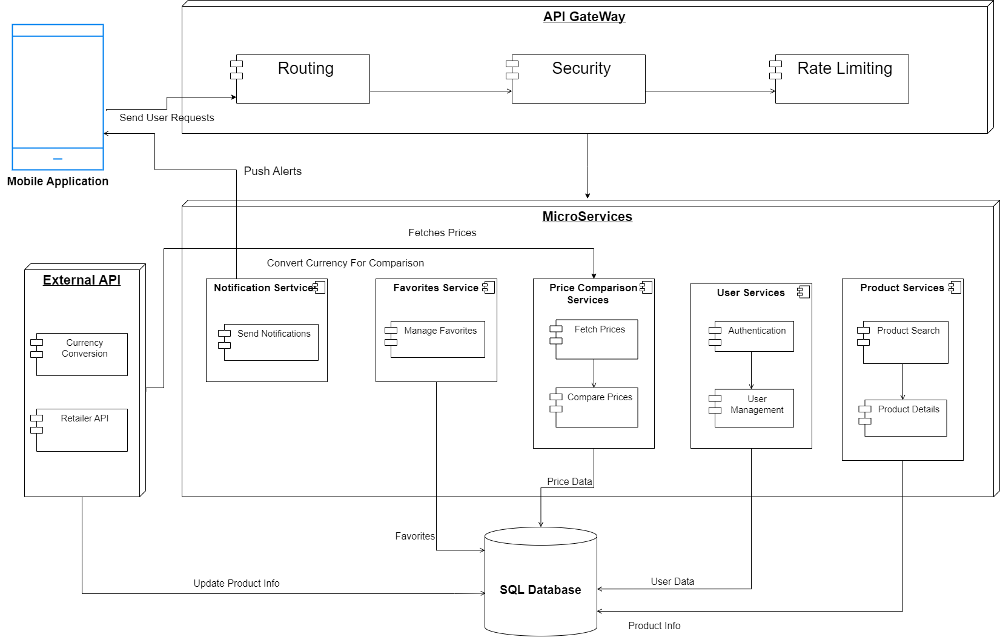

# PROJECT Design Documentation

## Project Name: Price Compare Plus

## Team Information

- Team name: TEAM 1
- Team members
  - Kush Jayesh Ahir
  - Love Jayesh Ahir
  - Shridhar Vilas Shinde
  - Bharathi Pandurangan

## Executive Summary

The "Price Compare Plus" project is to provide a mobile application that gives consumers access to product details and price comparisons from different online merchants. It provides customers with a comprehensive tool to locate the cheapest prices on a variety of items by centralizing data from several sources. The program aims to improve the online shopping experience by providing access to comprehensive product descriptions, reviews, and price notifications, which will facilitate informed decision-making.

## Requirements

This section describes the features of the application.

### Definition of MVP

The "Price Compare Plus" MVP is a mobile application that enables users to browse product details, compare prices from various online merchants, search for items, save favorites, and get alerts when prices drop.

### MVP Features

1. User Authentication: Implement user registration and login functionality to allow users to create accounts and log in securely.
2. Product Search: Enable users to search for products by name using a search bar or a search function.
3. Product Details Display: Display detailed information about each product, including its features, specifications, and descriptions.
4. Price Comparison: Gather pricing information for the searched product from different online retailers and display them in a comparative format.
5. Save Favorites: Allow users to save products they're interested in, to a favorites list for easy access later.
6. Product Reviews: Integrate product review functionality to provide users with insights from other consumers' experiences.
7. Sort and Filter Options: Provide users with the ability to sort search results by criteria such as price, relevance, or ratings, and filter results based on factors like brand, price range, or availability.
8. Product Image Display: Show images of the searched product to help users identify it visually.
9. Basic User Interface (UI): Create a simple intuitive user interface with essential components such as search bar, product display area, and navigation menu.
10. Responsive Design: Ensure that the app is responsive and works well on various mobile devices and screen sizes.
11. Currency Conversion: Incorporate currency conversion functionality to allow users to view prices in their preferred currency. This feature can be especially useful for users who shop across different regions or countries.
12. Price Drop Notifications: Enable users to receive notifications when the prices of their saved favorite products drop below a specified threshold. This feature allows users to take advantage of discounts and promotions without constantly monitoring prices themselves.

## Architecture and Design

This section describes the application architecture.

### Software Architecture

The "Price Compare Plus" application employs a microservices architecture to enable robust, scalable online shopping features. The architecture is delineated into several key components:

- **Mobile App**: The front-end interface that interacts with users, pushing alerts and sending user requests.
- **Microservices**: Decomposed backend services, including:
  - **Notification Service**: Manages and sends notifications to users.
  - **Favorites Service**: Handles the management of user favorites.
  - **Price Comparison Service**: Fetches and compares prices from various sources.
  - **User Service**: Responsible for authentication and user management.
  - **Product Service**: Manages product search and details retrieval.
- **External APIs**: Interfaces with Currency Conversion API and Retailer APIs to update product information and facilitate currency conversion.
- **API Gateway**: Acts as the entry point for all client requests, routing them to the appropriate microservice and providing security measures like rate limiting.
- **SQL Database**: Stores user data including credentials and profiles as well as product-related data such as price data and favorites for quick retrieval.

The architecture supports both RESTful services and third-party API integration, ensuring that product information is current and accurate. The use of both SQL and NoSQL databases caters to the efficient management of structured and unstructured data respectively.

### Use Cases

**Actors**: The diagram includes three actors: User, Admin, and System.
**Use Cases**: Within the "Price Compare Plus" package, there are several key use cases outlined:

- User-related use cases such as User Authentication, Product Search, Save Favorites, and Sort and Filter Options.
- System-related use cases including Price Comparison, Product Details Display, Product Image Display, Currency Conversion, and Price Drop Notifications.
- The Manage User use case is specifically related to the Admin actor, indicating their ability to manage user-related functionalities.

### Class Diagram

### Class Diagram Description
- **User Class:**
  -**Attributes:**:
    UserID: int - A unique identifier for each user.
    Username: String - The username of the user.
    Password: String - The password of the user.
    Email: String - The email address of the user.
  -**Operations**:
    login(): void - Allows the user to log in to the application.
    register(): void - Allows the user to register for an account.
    logout(): void - Allows the user to log out of the application.

- **Product Class**:
  - **Attributes**:
    productID: int - A unique identifier for each product.
    description: String - A description of the product.
    price: double - The price of the product.
    brand: string - The brand of the product.
  - **Operations**:
    getdetails(): void - Retrieves the details of a product.
    imageurl(): void - Retrieves the image URL of a product.

- **Notification Class**:
  - **Attributes**:
    notificationID: int - A unique identifier for each notification.
    userID: int - The ID of the user who received the notification.
    message string - The content of the notification.
    timestamp: DateTime - The date and time the notification was sent.

- **Authentication Class**:
  - **Attributes**:
    Username: String - The username of the user.
    Password: String - The password of the user.
  - **Operations**:
    login(): void - Allows the user to log in to the application.
    logout(): void - Allows the user to log out of the application.

- **Shopping Cart Class**:
  - **Attributes**:
    cartID: int - A unique identifier for each shopping cart.
    userID: int - The ID of the user who owns the shopping cart.
    productlist: list<products> - A list of products in the shopping cart.
    totalamount double - The total amount of the items in the shopping cart.
  - **Operations**:
    addproduct(): void - Adds a product to the shopping cart.
    removeproduct():void - Removes a product from the shopping cart.
    checkout():void - Completes the checkout process.

- **Favorites Class**:
  - **Attributes**:
    favoriteID: int - A unique identifier for each favorite item.
    userID int - The ID of the user who favorited the item.
    productID: int - The ID of the product that is favorited.

- **Price Comparison Class**:
  - **Attributes**:
    ProductID: int - The ID of the product
    retailerD int - The ID of the retailer who is selling it.

- **Currency Conversion Class**:
  - **Operations**:
    convert: int - Converts currency into different types.
    
  
# Price Compare Plus - User Authentication Feature

## Overview

Price Compare Plus's User Authentication feature ensures a secure and personalized shopping experience for users. The system allows users to sign up, log in, and access their accounts, which enables them to use functionalities like searching for products, adding them to favorites, and maintaining a shopping cart.

## Features

### Sign Up

The sign-up page is the entry point for new users. The process is straightforward, requesting essential information:

- First Name
- Last Name
- Email
- Username
- Password (hashed for security)
- Confirm Password

Form validations are in place to ensure data integrity. A session key is generated at this stage but remains null until the user logs in.
Passwords are hashed before storage.

### Log In

Returning users will authenticate themselves on the login page by entering their:

- Username
- Password

Upon successful authentication, a unique session key is generated to manage the user's session. The system includes protective measures such as validation checks that trigger generic error messages for improved user privacy.

- Incorrect Username
  - If a user enters a username that does not exist in the database, they will receive the following message:
  - **"Invalid username or password, please try again."**
- Incorrect Password
  - If a user enters a valid username but the wrong password, they will receive the same message as above:
  - **"Invalid password, please try again."**

### Home

The home page serves as the main dashboard, featuring:

- A search bar for product queries.
- Navigation buttons for the Home, Favorites, Shopping Cart, and Account sections.
- Products Available for purchase eg. Phones,Headphones etc.

### Product

The Products page showcases a list of items available for comparison. Users can browse through the selection of phones and electronic devices, view detailed descriptions, and compare prices from different retailers.

featuring:

- Product Descriptions: Detailed insights into product features, specifications, and enhancements, allowing users to make informed decisions.
- Price Listing: Displays the current prices from various retailers, ensuring users can find the best deal.

### ProductDescription

The Product Description page provides in-depth information about each product, including camera specs, processor details, and other unique features.

featuring:

- Product Title.
- Product Image.
- Product Description.
- Retailers Available with their current Price.

### Shopping Cart

The shopping cart displays all the products that the user intends to purchase. Each product includes details like quantity and pricing.

### Account

The Account section displays the logged-in user's:

- Username
- First Name
- Last Name
- Email

A logout option is available for users to end their session. On logout, the session key is reset to null to maintain security, preventing unauthorized access and maintaining the privacy and integrity of the user's session.

---

### Coverage 

### LICENSE 
  

